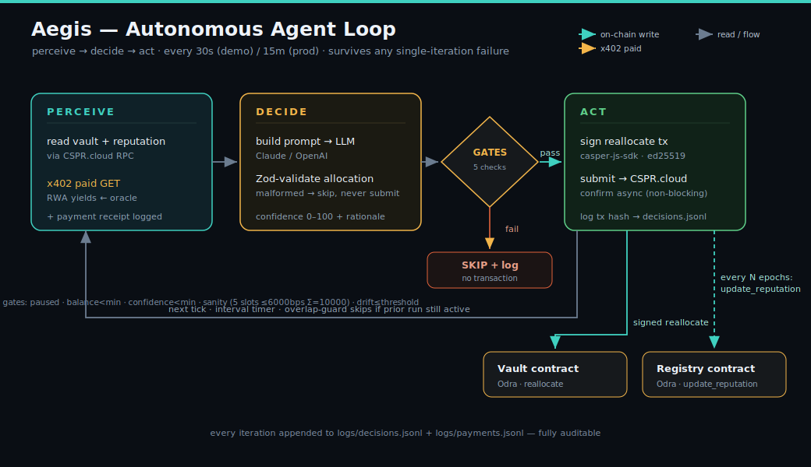

# Aegis — Autonomous RWA Yield-Routing Agent

> **Built for Casper Agentic Buildathon 2026**
> Qualification Round · 2026-06-18 · Open Source · Casper Testnet

---

## What is Aegis?

Aegis is an autonomous on-chain portfolio manager for Casper Network. Every 30 seconds it monitors five simulated tokenized real-world-asset (RWA) yield instruments — T-bills, private credit, commodities, stable yield, and CSPR liquid staking — pays for that data via an x402 micropayment, asks an LLM to reason about optimal allocation, and autonomously submits a reallocation transaction to an Odra-based vault contract on Casper Testnet. Every decision is logged with a full audit trail. The agent's prediction accuracy is written back on-chain as a verifiable reputation score, giving the agent a tamper-proof track record.

**Problem:** Tokenized RWA yield is fragmented and moves fast. Manual rebalancing is slow, error-prone, and requires 24/7 human oversight.
**Solution:** A fully autonomous agent that perceives chain state and oracle data, reasons with an LLM, and acts on-chain — while accumulating a verifiable reputation for the quality of its decisions.

---

## Table of Contents

1. [Architecture](#architecture)
2. [Casper AI Toolkit Coverage](#casper-ai-toolkit-coverage)
3. [Quickstart — No Keys Needed](#quickstart--no-keys-needed)
4. [Environment Variables](#environment-variables)
5. [Running Tests](#running-tests)
6. [MCP Tools and Resources](#mcp-tools-and-resources)
7. [Project Layout](#project-layout)
8. [Testnet Deploy](#testnet-deploy)
9. [Long-Term Launch Plan](#long-term-launch-plan)
10. [Demo Video](#demo-video)

---

## Architecture


<details>
<summary>Mermaid source (same diagram, text form)</summary>

```mermaid
flowchart TB
  subgraph Browser["Browser"]
    DASH["Dashboard (Next.js 15 / React 19)"]
    WALLET["Casper Wallet ext (CSPR.click)"]
  end

  subgraph Node["Node.js services (pnpm monorepo)"]
    AGENT["agent\nperceive→decide→act loop"]
    ORACLE["oracle\nx402-gated RWA API (Express)"]
    MCP["mcp-server\n6 tools / 4 resources (stdio)"]
    SHARED["@aegis/shared\ntypes + zod schemas + env loader"]
  end

  subgraph Chain["Casper Testnet (source of truth)"]
    VAULT["Vault contract (Odra)\ndeposit / withdraw / reallocate / pause"]
    REG["Registry contract (Odra)\nregister / update / get reputation"]
  end

  subgraph Ext["External"]
    LLM["LLM provider\n(Anthropic Claude default / OpenAI swap)"]
    CSPRCLOUD["CSPR.cloud REST + node RPC"]
    EXPLORER["cspr.live testnet explorer"]
  end

  DASH -- "deposit / withdraw (signed)" --> WALLET
  WALLET -- "tx" --> CSPRCLOUD
  DASH -- "poll 15s" --> CSPRCLOUD
  DASH -- "read logs via Next API route" --> AGENT
  DASH -- "tx links" --> EXPLORER

  AGENT -- "vault state + reputation" --> CSPRCLOUD
  AGENT -- "x402 paid GET /api/rwa-yields" --> ORACLE
  AGENT -- "decision prompt" --> LLM
  AGENT -- "signed reallocate / update_reputation" --> CSPRCLOUD
  CSPRCLOUD -- "transactions" --> VAULT
  CSPRCLOUD -- "transactions" --> REG

  MCP -- "tools reuse same clients" --> CSPRCLOUD
  MCP -- "tools call" --> ORACLE

  ORACLE -- "verify payment" --> FAC["PaymentFacilitator\n(MockFacilitator default)"]

  SHARED -. "types + zod + env" .-> AGENT
  SHARED -. "" .-> ORACLE
  SHARED -. "" .-> MCP
  SHARED -. "" .-> DASH
```

</details>

The agent runs a `perceive → decide → act` loop:



1. **Perceive** — query vault state from CSPR.cloud, fetch oracle data via an x402-signed micropayment, read on-chain reputation.
2. **Decide** — build a structured prompt, call the LLM, Zod-validate the JSON response, write a `DecisionLogEntry` to `logs/decisions.jsonl`.
3. **Gate** — skip if vault is paused, balance is too low, confidence is too low, allocation fails the sanity bound, or drift is within threshold.
4. **Act** — sign and submit a `reallocate` transaction with 3x exponential backoff; confirm asynchronously so the loop never blocks.
5. **Reputation** — every 3 epochs, evaluate prediction accuracy and submit an `update_reputation` transaction with a SHA-256 rationale hash.

See [`docs/ARCHITECTURE.md`](docs/ARCHITECTURE.md) for the full component design and data flows.

---

## Casper AI Toolkit Coverage

| Pillar | How Aegis uses it |
|---|---|
| **Odra** | Two Odra 2.8.1 contracts: `vault.rs` (CEP-18 shares, reallocate, pause) and `registry.rs` (reputation scores, delta clamping). Full unit suite on the Odra in-memory backend — 29 tests green via `cargo test`. |
| **MCP** | Custom stdio MCP server (`@modelcontextprotocol/sdk`, MCP 2025-11-25) exposing 6 tools and 4 resources. Any LLM client or Claude Desktop can introspect live chain state, query oracle data, read the decision log, and trigger reallocations. |
| **x402** | Every oracle API call requires an x402 payment. The agent constructs and signs a `PaymentPayload`, the oracle verifies it via `MockFacilitator` (default) or `CasperFacilitator` (env swap). Payment receipts are logged to `logs/payments.jsonl` before each decision entry. |
| **CSPR.cloud / CSPR.click** | All chain reads (vault state, reputation) go through CSPR.cloud REST API. Transaction submission uses the CSPR.cloud node RPC. The dashboard integrates `@make-software/csprclick-core-client` for Casper Wallet signing of deposit/withdraw transactions. |

---

## Quickstart — No Keys Needed

The mock mode runs the full agent loop with a `MockLlmClient` and `MockFacilitator` — no Anthropic key, no Casper key, no CSPR.cloud key required.

**Prerequisites:** Node.js 22 LTS, pnpm 9+, Rust (nightly, see contracts note).

```bash
# 1. Clone and install
git clone <repo-url> aegis && cd aegis
pnpm install

# 2. Copy env and enable the self-contained offline demo (no secrets needed)
cp .env.example .env
echo "AGENT_OFFLINE_DEMO=true" >> .env   # full perceive→decide→act cycle, no keys/chain

# 3. Start the oracle (port 4021) — in terminal 1
pnpm --filter @aegis/oracle start

# 4. Start the agent loop — in terminal 2
pnpm --filter @aegis/agent start

# 5. Start the MCP server — in terminal 3 (or connect via MCP inspector)
pnpm --filter @aegis/mcp-server start

# 6. Start the dashboard — in terminal 4
pnpm --filter @aegis/dashboard dev
# Open http://localhost:3000
```

> **`AGENT_OFFLINE_DEMO=true`** is the zero-friction path: the agent uses seeded
> placeholder chain reads (no CSPR.cloud calls, no rate-limit/quota), a deterministic
> `MockLlmClient`, and an in-memory mock tx client, so the **full perceive→decide→act
> cycle completes locally** and the decision feed shows `acted:true` with clearly-marked
> `mock-reallocate-…` hashes — it never submits on-chain. Leave it `false` (default) to run
> against real deployed contracts with a funded key + CSPR.cloud key, in which case the agent
> only performs an on-chain reallocation when chain reads succeed (otherwise it safely backs off).

### Testnet demo — recovery after RPC rate limits (HTTP 429)

If the dashboard shows **STALE** badges, reputation as **"—"**, or the agent logs long `Code: 429` retries:

1. **Stop** the agent and dashboard (`Ctrl+C` in both terminals).
2. **Wait 2–3 minutes** for the CSPR.cloud rate-limit window to reset.
3. **Start in order** (rebuild shared/agent after pulling code changes):
   ```bash
   pnpm oracle                                    # terminal 1
   pnpm --filter @aegis/shared build \
     && pnpm --filter @aegis/agent build \
     && pnpm agent                                # terminal 2
   pnpm dev                                       # terminal 3 — restart so API routes reload
   ```
4. For demos, prefer **`AGENT_OFFLINE_DEMO=true`** (zero cspr.cloud calls). For a live *online* run, keep `AGENT_LOOP_INTERVAL_MS` at the default `900000` (15 min) — shorter cadences (e.g. 30000) exhaust the free-tier 1200/day quota and the agent will warn at startup.
5. Avoid rapid manual **Trigger Agent Run** clicks — wait for one iteration to finish.

Ensure `packages/dashboard/.env.local` includes `CASPER_NODE_RPC_URL` and `REPUTATION_SEED_SCORE=50` so vault/reputation API routes fast-fail to fallback data instead of hanging.

**Inspect the MCP server:**

```bash
npx @modelcontextprotocol/inspector packages/mcp-server/dist/server.js
```

---

## Environment Variables

Copy `.env.example` to `.env`. All values have sensible defaults for mock/local mode. Secrets are optional unless you run against testnet.

| Variable | Default | Required for | Description |
|---|---|---|---|
| `CASPER_NETWORK` | `casper-test` | All | Network identifier |
| `CASPER_NODE_RPC_URL` | CSPR.cloud testnet | Testnet | Casper node RPC endpoint |
| `CSPR_CLOUD_API_URL` | CSPR.cloud testnet | Testnet | REST API base URL |
| `CSPR_CLOUD_API_KEY` | — | Testnet | CSPR.cloud API key |
| `VAULT_CONTRACT_HASH` | — | Testnet | Populated by `deploy:testnet` |
| `REGISTRY_CONTRACT_HASH` | — | Testnet | Populated by `deploy:testnet` |
| `AGENT_PRIVATE_KEY_HEX` | — | Testnet | Hex ed25519/secp256k1 testnet key |
| `AGENT_ACCOUNT_HASH` | — | Testnet | Corresponding account hash |
| `LLM_PROVIDER` | `anthropic` | Live LLM | `anthropic` or `openai` |
| `ANTHROPIC_API_KEY` | — | Live LLM | Falls back to MockLlmClient if absent |
| `ANTHROPIC_MODEL` | `claude-sonnet-4-6` | Live LLM | Model name |
| `OPENAI_API_KEY` | — | OpenAI mode | Set with `LLM_PROVIDER=openai` |
| `OPENAI_MODEL` | `gpt-4o` | OpenAI mode | Model name |
| `ORACLE_PORT` | `4021` | Oracle | Oracle server port |
| `ORACLE_URL` | `http://localhost:4021` | Agent | Oracle URL seen by agent |
| `ORACLE_PRICE_MOTES` | `1000000` | Oracle | 0.001 CSPR per oracle call |
| `X402_FACILITATOR` | `mock` | Payment | `mock` or `live` |
| `X402_FACILITATOR_URL` | — | Live x402 | Live facilitator endpoint |
| `AGENT_LOOP_INTERVAL_MS` | `900000` | Agent | Loop cadence. Default 15min keeps online runs under the cspr.cloud free-tier quota (~1200/day); offline demo auto-runs ~15s |
| `REALLOCATION_DRIFT_BPS` | `200` | Agent | Min drift to trigger reallocation |
| `MIN_CONFIDENCE_THRESHOLD` | `60` | Agent | LLM confidence gate |
| `MIN_VAULT_BALANCE_MOTES` | `100000000000` | Agent | 100 CSPR minimum |
| `MAX_ASSET_WEIGHT_BPS` | `6000` | Agent | Max concentration per asset (60%) |
| `TX_CONFIRM_TIMEOUT_MS` | `60000` | Agent | On-chain confirm timeout |
| `REPUTATION_UPDATE_EPOCHS` | `3` | Agent | Epochs between reputation updates |
| `REPUTATION_SEED_SCORE` | `50` | Agent | Initial reputation seed |
| `ALLOW_TESTNET_DEPLOY` | `false` | Deploy | Safety guard for `deploy:testnet` |

---

## Running Tests

**TypeScript packages (Vitest):**

```bash
# All packages
pnpm -r test

# Single package
pnpm --filter @aegis/shared test
pnpm --filter @aegis/agent test
pnpm --filter @aegis/oracle test
pnpm --filter @aegis/mcp-server test
```

**Smart contracts (Odra in-memory backend, no testnet):**

```bash
cd contracts
cargo test
```

The contract suite runs 29 tests entirely on the Odra VM — no network, no wallet, no funded account needed. Covered: deposit, withdraw, reallocate, access-control rejection, pause behavior, reputation update, reputation clamp at zero, seed score seeding.

**Total: 178 tests green.**

---

## MCP Tools and Resources

The stdio MCP server exposes the full Aegis surface to any LLM client.

### Tools (executable actions)

| Tool | Description |
|---|---|
| `get_vault_state` | Query current vault state (balance, shares, allocation, agent hash, paused) |
| `get_agent_reputation` | Query agent reputation (score, decisions, correct predictions) |
| `submit_reallocation` | Submit a signed reallocation transaction (supports `dry_run` mode) |
| `fetch_rwa_oracle_data` | Fetch yield data via the x402-gated oracle endpoint |
| `get_decision_log` | Read the last N agent decision log entries |
| `get_transaction_status` | Query a transaction hash on testnet |

### Resources (read-only context)

| URI | Description |
|---|---|
| `aegis://vault/state` | Live vault state |
| `aegis://agent/reputation` | Agent reputation profile |
| `aegis://decisions/recent` | Last 10 decision log entries |
| `aegis://oracle/latest` | Most recent oracle data snapshot |

---

## Project Layout

```
/
├── contracts/                   # Rust / Odra 2.8.1 smart contracts
│   ├── aegis-contracts/
│   │   ├── src/
│   │   │   ├── vault.rs         # Vault: deposit/withdraw/reallocate/pause
│   │   │   ├── registry.rs      # Reputation registry: register/update/get
│   │   │   └── lib.rs
│   │   └── Cargo.toml           # Odra 2.8.1 pinned
│   ├── deployments/
│   │   └── testnet.json         # Contract hashes (populated by deploy:testnet)
│   └── rust-toolchain.toml      # nightly-2026-01-01 (required by odra-macros)
├── packages/
│   ├── shared/                  # @aegis/shared — canonical types, Zod schemas, env loader
│   │   └── src/
│   │       ├── types.ts         # VaultState, AgentReputation, PaymentPayload, etc.
│   │       ├── schemas.ts       # Zod schemas mirroring types.ts
│   │       ├── env.ts           # Fail-fast env loader
│   │       ├── allocation.ts    # allocationSanityCheck, driftBps utilities
│   │       └── jsonl.ts         # appendJsonl, readJsonl helpers
│   ├── oracle/                  # @aegis/oracle — Express x402-gated oracle API
│   │   └── src/
│   │       ├── app.ts           # Express routes (/api/health, /api/rwa-yields)
│   │       ├── facilitator.ts   # MockFacilitator / CasperFacilitator
│   │       ├── seed-data.ts     # Deterministic RWA asset data
│   │       └── server.ts        # Process entry point (port 4021)
│   ├── agent/                   # @aegis/agent — autonomous perceive→decide→act loop
│   │   └── src/
│   │       ├── loop.ts          # AgentLoop state machine
│   │       ├── run.ts           # Process entry point
│   │       ├── reputation.ts    # computeReputationDelta
│   │       └── clients/
│   │           ├── llm-client.ts        # AnthropicClient / OpenAiClient / MockLlmClient
│   │           ├── oracle-client.ts     # OracleClient (x402 request construction)
│   │           ├── casper-read-client.ts # CSPR.cloud reads (vault state, reputation)
│   │           └── casper-tx-client.ts  # Transaction signing + submission
│   ├── mcp-server/              # @aegis/mcp-server — stdio MCP 2025-11-25 server
│   │   └── src/
│   │       ├── mcp-server.ts    # Server factory (6 tools + 4 resources)
│   │       ├── tools.ts         # Tool handler implementations
│   │       └── server.ts        # Process entry point
│   └── dashboard/               # @aegis/dashboard — Next.js 15 cockpit UI
│       └── src/app/
│           ├── page.tsx         # Cockpit main page
│           ├── components/      # VaultOverview, AllocationChart, DecisionFeed, etc.
│           ├── api/             # Next API routes (trigger, logs)
│           └── hooks/           # SWR polling hooks
├── logs/                        # Append-only JSONL audit logs (gitignored)
│   ├── decisions.jsonl
│   └── payments.jsonl
├── docs/
│   ├── ARCHITECTURE.md
│   ├── DESIGN.md                # UI/UX specification (owned by design team)
│   ├── RUNBOOK.md
│   └── adr/                     # Architecture Decision Records
├── .env.example                 # Env template — no secrets
├── PLAN.md                      # Architecture source of truth
├── REQUIREMENTS.md
├── ASSUMPTIONS.md
└── SECURITY.md
```

---

## Testnet Deploy

Testnet deployment is a gated manual step. It requires a funded Casper Testnet account (get CSPR from the [testnet faucet](https://testnet.cspr.live/tools/faucet)), the Odra Wasm toolchain, and your testnet keypair.

See [`DEPLOYMENT.md`](DEPLOYMENT.md) for the full step-by-step guide, including:

- Rust nightly toolchain setup (`nightly-2026-01-01`)
- `wasm-opt` and `wasm-strip` installation (binaryen + WABT)
- `cargo odra build` to compile contracts to Wasm
- Running `ALLOW_TESTNET_DEPLOY=true pnpm deploy:testnet`
- Verifying contract hashes on cspr.live
- Seeding the agent reputation via `register_agent` and the initial `update_reputation`

> The deploy flag `ALLOW_TESTNET_DEPLOY=false` is enforced by the env loader. Without setting it to `true`, the deploy script exits immediately.

---

## Long-Term Launch Plan

Aegis is a testnet prototype built for the Casper Agentic Buildathon 2026. This section documents the mainnet path for judges evaluating long-term impact.

### Phase 1 — Mainnet Preparation (Q3 2026)

- **Security audit:** Formal audit of vault and registry contracts addressing the findings in `SECURITY.md` (SEC-01 purse capture, SEC-02 share inflation mitigation, SEC-03 real x402 cryptographic verification, SEC-10 on-chain allocation bounds).
- **Key separation:** Split the owner/agent keypair (A-016 demo shortcut) into a distinct operator key (owns contracts, submits `update_reputation`) and agent key (holds only `reallocate` rights).
- **Real x402 facilitator:** Swap `MockFacilitator` for the live `CasperFacilitator` endpoint once stable on mainnet; `X402_FACILITATOR=live` + `X402_FACILITATOR_URL` is the only change needed.

### Phase 2 — Real Oracle Integration (Q4 2026)

- Replace the seeded RWA data with a live oracle feed (Centrifuge, rwa.xyz, or Ondo) by implementing a real `RwaOracleClient` behind the same interface — no agent loop changes required.
- Add on-chain price proof anchoring via oracle signatures to prevent prompt injection (SEC-05).
- Multi-source oracle aggregation with outlier detection before LLM prompt construction.

### Phase 3 — Ecosystem Growth (2027)

- **AEGIS governance token:** On-chain voting for risk parameter overrides (max concentration, drift threshold, minimum balance).
- **Multi-vault support:** Allocate across multiple vaults with distinct risk profiles; agents maintain per-vault reputation.
- **Reputation leaderboard:** MCP-federated reputation queries across multiple registered agents.
- **Cross-chain expansion:** Bridge-aware vault tracking (Casper + EVM) as Casper bridge infrastructure matures.

### Socials / Community

- Website: TBD
- Twitter/X: TBD
- Discord: TBD

---

## Demo Video

> Demo video link: **[TO BE ADDED BEFORE SUBMISSION]**

The demo covers: wallet connect, vault deposit, agent loop running live, an x402 oracle call with payment receipt, an on-chain reallocation transaction, a reputation score update, and verification on cspr.live testnet explorer.

See [`docs/DEMO.md`](docs/DEMO.md) for the full beat-by-beat script (SC-11), including exact commands and clicks for each scene, which beats require a funded testnet key vs which run fully locally with mocks, and camera/screen directions.

Expected location: `docs/demo.mp4` or the link above.

---

## Prerequisites Summary

| Tool | Version | Notes |
|---|---|---|
| Node.js | 22 LTS | Agent, oracle, MCP server, dashboard |
| pnpm | 9+ | Workspace manager |
| Rust | nightly-2026-01-01 | Required by `odra-macros 2.8.1` (box_patterns) |
| `wasm-opt` | any | binaryen — for `cargo odra build` only |
| `wasm-strip` | any | WABT — for `cargo odra build` only |
| `cargo-odra` | latest | `cargo install cargo-odra` — for contract build only |

For local development and testing, only Node.js and pnpm are strictly required (Rust is needed only for contract builds and tests).

---

## License

MIT. See individual package files for third-party licenses.

---

*Aegis is a Casper Agentic Buildathon 2026 submission. It is a testnet prototype: no real funds are at risk, no real RWA instruments are traded, and no production key custody is implemented. All on-chain activity uses freely available testnet CSPR.*
