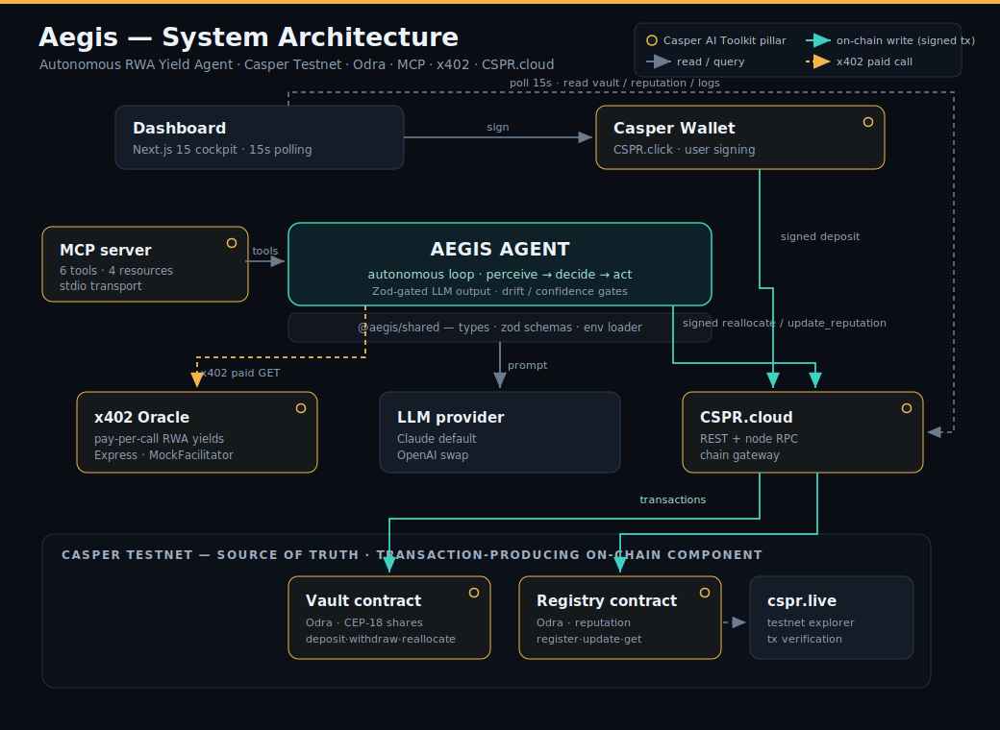
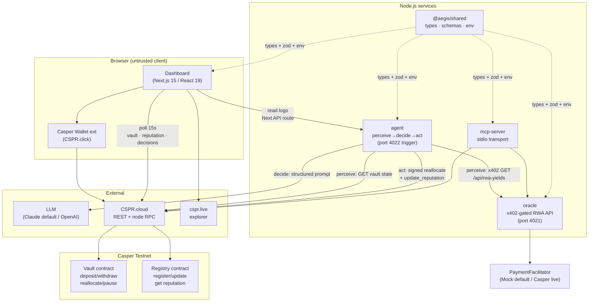
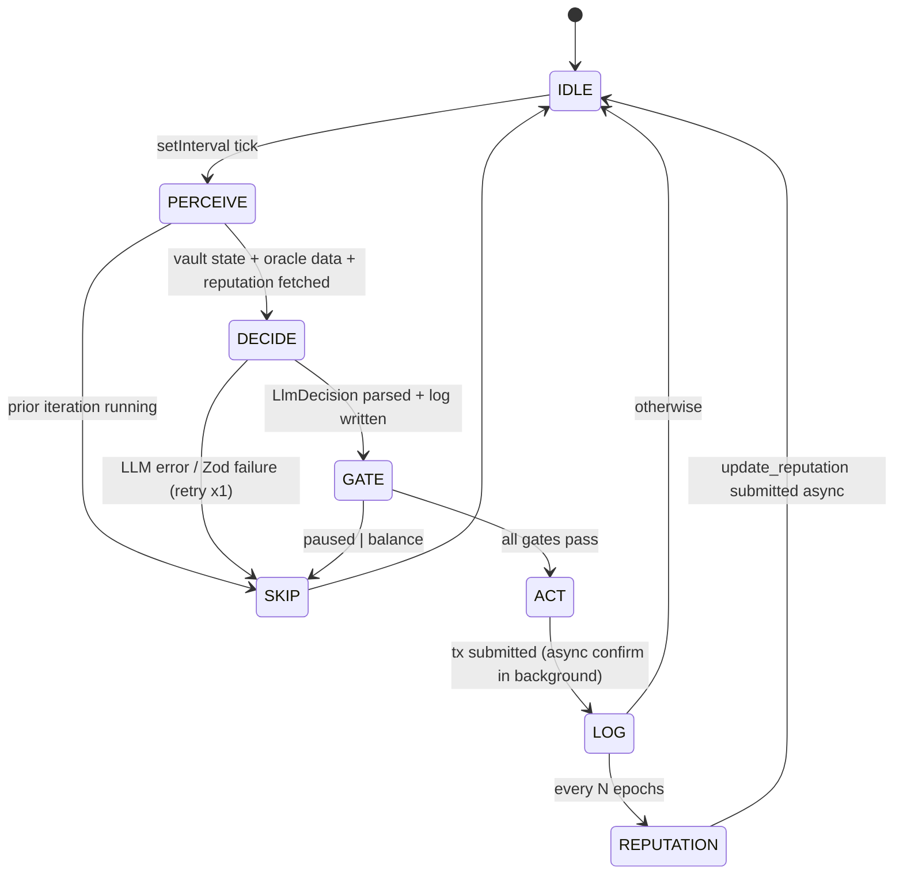
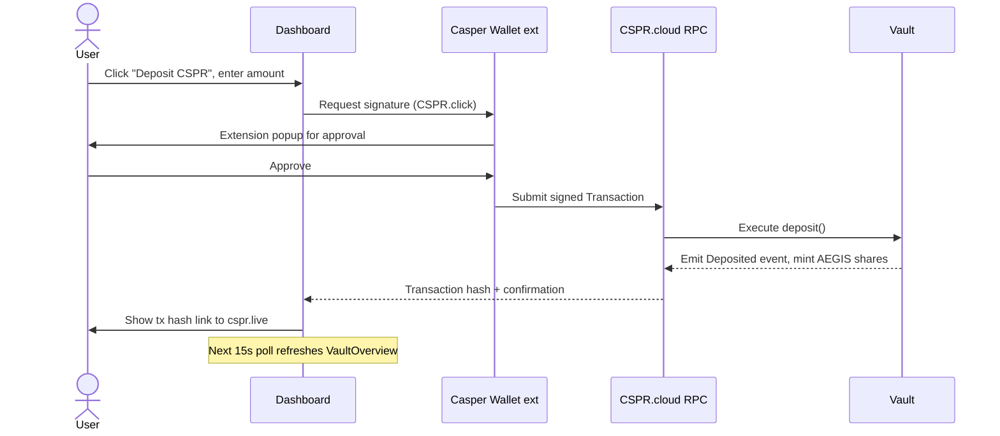
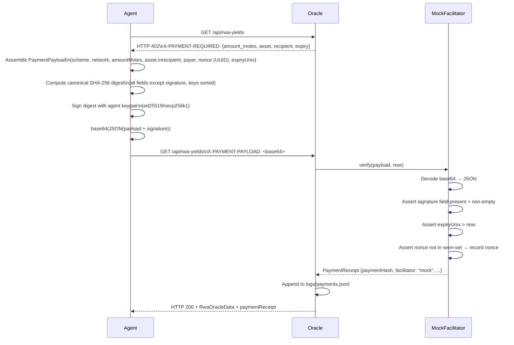

# Aegis — Architecture

**Version:** 1.0
**Date:** 2026-06-18
**Source of truth:** This document derives from `PLAN.md` (architect round 1) and the actual source code. When in conflict, the code wins.

---

## Table of Contents

1. [System Overview](#1-system-overview)
2. [Component Responsibilities](#2-component-responsibilities)
3. [The Perceive→Decide→Act Loop](#3-the-perceivedeckideact-loop)
4. [Critical Data Flows](#4-critical-data-flows)
5. [The x402 Payment Flow](#5-the-x402-payment-flow)
6. [Trust Boundaries](#6-trust-boundaries)
7. [Key Interfaces](#7-key-interfaces)
8. [State: On-chain vs Off-chain](#8-state-on-chain-vs-off-chain)
9. [Monorepo Structure](#9-monorepo-structure)
10. [Technology Choices](#10-technology-choices)

---

## 1. System Overview

Aegis is a **5-service + 2-contract** system. Five Node.js services run off-chain; two Odra contracts run on Casper Testnet and are the authoritative source of truth for vault balances and reputation scores.



> Rendered diagram above; the Mermaid source below is kept in sync for text-based tooling.



---

## 2. Component Responsibilities

### 2.1 `contracts/aegis-contracts` — Odra contracts (Rust)

Two contracts compiled to Wasm, deployed on Casper Testnet.

**Vault (`vault.rs`)**

| Entry point | Access | Behaviour |
|---|---|---|
| `init(owner, agent, name, symbol)` | Constructor | Sets owner, agent, initialises CEP-18 share token |
| `deposit()` payable | Any | Mints proportional AEGIS shares; 1:1 on first deposit |
| `withdraw(shares: U256)` | Any holder | Burns shares, transfers proportional motes |
| `reallocate(allocation: Vec<(u8,u16)>)` | Agent only | Asserts sum==10_000, updates allocation map, emits `Reallocated` |
| `set_paused(bool)` | Owner only | Emergency stop — blocks deposit/withdraw/reallocate |
| `set_agent(AccountHash)` | Owner only | Rotate agent key |
| `get_state()` | Any, no signing | Returns `VaultState` as a named key |

Storage: `Var<U512>` balance mirror, `Cep18` share sub-module, `Mapping<u8,u16>` allocation bps, `Var<bool>` paused, `Var<Address>` owner/agent.

**Registry (`registry.rs`)**

| Entry point | Access | Behaviour |
|---|---|---|
| `init(owner)` | Constructor | Sets owner |
| `register_agent(agent: Address)` | Owner only | Creates profile with score 0 and counters at 0 |
| `update_reputation(agent, delta: i64, rationale_hash: [u8;32])` | Owner only | Applies delta with `saturating_sub/add`, clamps at zero, emits `ReputationUpdated` |
| `get_reputation(agent)` | Any, no signing | Returns `AgentReputation` named key |

Note: `i64::MIN` negation is handled safely via `unsigned_abs()` — there is an explicit test for this edge case.

**Testnet deployment note (A-016):** In the demo, a single keypair is both the contract owner and the registered agent account hash. Production deployment splits these roles.

### 2.2 `packages/oracle` — x402-Gated RWA Oracle (Express)

A two-route Express server providing simulated RWA yield data behind an x402 payment gate.

- `GET /api/health` — public; returns `{ status: "ok", version, uptime_ms }`.
- `GET /api/rwa-yields` — payment-gated:
  - No `X-PAYMENT-PAYLOAD` header → `HTTP 402` + `X-PAYMENT-REQUIRED` header.
  - With header → `PaymentFacilitator.verify(payload, now)` → `HTTP 200` + 5-asset payload + payment receipt.

`MockFacilitator` (default) checks: `signature` field present and non-empty, `expiryUnix > now`, `nonce` not in the in-memory seen-set. It does not cryptographically verify the signature — that is `CasperFacilitator`'s job. Payment receipts are appended to `logs/payments.jsonl`.

Seeded assets (A-005): tokenized T-bills (~5.1% APY), private credit (~8.5%), commodities (~3.2%), stable yield (~4.7%), CSPR liquid staking (~6.3%). Demo mode injects yield shifts every 60 seconds to ensure reallocation events fire during a demo.

### 2.3 `packages/agent` — Autonomous Agent Loop (TypeScript)

The active core of Aegis. Runs a `setInterval`-driven loop (`AGENT_LOOP_INTERVAL_MS`, default 30s).

**Key classes:**
- `AgentLoop` — state machine; all external clients injected via constructor for testability.
- `CasperReadClient` — CSPR.cloud REST reads; 10s TTL cache to avoid rate limits (RISK-03).
- `OracleClient` — constructs and signs the `X-PAYMENT-PAYLOAD`, handles the 402→pay→200 flow.
- `CasperTxClient` — builds, signs, and submits Casper 2.0 `Transaction` objects; 3x exponential backoff (1s/2s/4s).
- `AnthropicClient` / `OpenAiClient` / `MockLlmClient` — all satisfy the `LlmClient` interface.

Also exposes a trigger endpoint on port 4022 for the dashboard's "Trigger Agent Run" button.

### 2.4 `packages/mcp-server` — MCP Server (TypeScript, stdio)

Implements MCP 2025-11-25 via `@modelcontextprotocol/sdk`. Transport is stdio so it works with MCP Inspector and Claude Desktop out of the box, with no network/CORS/auth surface.

Reuses the same client classes as the agent — no logic duplication. Tool calls are logged to stderr (stdout is the MCP channel). Tool errors return structured MCP error objects; the server never crashes on a tool failure.

`submit_reallocation` signs with the server-held context, not with a key passed as a tool argument — a deliberate security improvement over the original spec (see ADR-0003 and SEC-09 in `SECURITY.md`).

### 2.5 `packages/shared` — Shared Package (TypeScript)

The single source of truth for all canonical types and schemas used by every TypeScript service. Importing from here prevents type drift.

- `types.ts` — `VaultState`, `AgentReputation`, `RwaOracleData`, `PaymentPayload`, `PaymentReceipt`, `DecisionLogEntry`, `LlmClient`, `PaymentFacilitator`.
- `schemas.ts` — Zod schemas mirroring every type; used as validation gates at all external boundaries.
- `env.ts` — `loadEnv()` validates the full env schema at startup and throws with a clear message listing every missing variable by name (never by value). `requireAgentEnv()` adds the signing key check.
- `allocation.ts` — `allocationSanityCheck()`, `driftBps()` utilities shared by agent and MCP server.
- `jsonl.ts` — `appendJsonl()`, `readJsonl()` for the audit log files.

### 2.6 `packages/dashboard` — Cockpit Dashboard (Next.js 15)

A single-page application at `/` with five panels: Vault Overview, Allocation Chart, Agent Reputation, Decision Feed, Oracle/x402 Panel. Wallet connect and deposit/withdraw flows use the `@make-software/csprclick-core-client` package.

State is polled every 15 seconds via SWR: on-chain state from CSPR.cloud, log data from a Next.js API route (`/api/logs`) that reads `logs/decisions.jsonl` and `logs/payments.jsonl` from disk.

The browser bundle never receives secrets. All `NEXT_PUBLIC_*` variables are non-secret URLs and contract hashes.

Visual direction: "Deep Space Instrument Panel" — Space Grotesk display type, JetBrains Mono for chain data, Inter for body text, amber-gold and cyan-green accent axes on a near-black background. See `docs/DESIGN.md` for the full specification.

---

## 3. The Perceive→Decide→Act Loop



**Overlap guard:** If `this.running === true` when the interval fires, the tick is logged as `skipReason: "prior_iteration_running"` and returns immediately. This prevents loop overlap when on-chain confirmation or LLM latency exceeds the interval.

**Non-blocking ACT:** The transaction hash is written to the decision log immediately after submission. A background `Promise` awaits confirmation up to `TX_CONFIRM_TIMEOUT_MS` (60s) and patches the log entry's status. The main loop is never blocked by the 60s confirm window.

**Allocation sanity gate (runs before drift check):**
- Exactly 5 entries, one per `assetId` 0..4.
- Each `bps` value must be ≤ `MAX_ASSET_WEIGHT_BPS` (default 6000 — 60% max concentration).
- `bps` values must sum to exactly 10,000.
- Duplicate `assetId` values are rejected.

This gate closes the exploit where a degenerate but high-drift allocation (e.g. 100% one asset) would otherwise pass the drift check.

---

## 4. Critical Data Flows

### Flow A — User Deposit (SC-02, SC-09)



SC-09 (wallet connect) requires the real Casper Wallet browser extension. The `casper-js-sdk` direct-sign path used in CI does not satisfy SC-09.

### Flow B — Autonomous Reallocation (SC-03, SC-04, SC-05)

```mermaid
sequenceDiagram
  participant Loop as AgentLoop
  participant CSPRCLOUD as CSPR.cloud
  participant Oracle
  participant LLM
  participant Vault

  Loop->>CSPRCLOUD: getState() [10s TTL cache]
  Loop->>Oracle: GET /api/rwa-yields (no header) → 402
  Loop->>Loop: Construct + sign PaymentPayload
  Loop->>Oracle: GET /api/rwa-yields (X-PAYMENT-PAYLOAD header)
  Oracle->>Oracle: MockFacilitator.verify() — nonce + expiry check
  Oracle-->>Loop: 200 + RwaOracleData + PaymentReceipt
  Loop->>Loop: Append PaymentReceipt to payments.jsonl
  Loop->>CSPRCLOUD: getReputation()
  Loop->>LLM: buildDecisionPrompt(ctx)
  LLM-->>Loop: { allocation, confidence, rationale } JSON
  Loop->>Loop: Zod validate + allocationSanityCheck + drift gate
  Loop->>Loop: Append DecisionLogEntry to decisions.jsonl
  Loop->>CSPRCLOUD: Submit signed reallocate() transaction
  CSPRCLOUD->>Vault: Execute reallocate()
  Vault-->>CSPRCLOUD: Emit Reallocated event
  Loop->>Loop: Write tx hash to log entry; background confirms
  Note over Loop: Dashboard sees update within 1 poll cycle (≤15s after confirmation)
```

### Flow C — Reputation Epoch Update (SC-06)

After every `REPUTATION_UPDATE_EPOCHS` (default 3) completed iterations:

1. Read prior `DecisionLogEntry` records from `decisions.jsonl`.
2. Call `computeReputationDelta()` — compare predicted top-yield asset against realized next-epoch oracle yields; `+1` if correct, `-1` otherwise.
3. SHA-256 hash the relevant log entries as `rationale_hash`.
4. Submit `update_reputation(agent, delta, rationale_hash)` asynchronously via `CasperTxClient`.
5. Registry applies delta with `saturating_sub/add`, clamps at 0, emits `ReputationUpdated`.
6. Dashboard reputation gauge updates on next poll.

In the testnet demo, the owner==agent keypair (A-016) signs this transaction, satisfying both NFR-S-03 (owner-only access control) and SC-06 (transaction from the agent account hash).

---

## 5. The x402 Payment Flow



**Mock vs Live:** `MockFacilitator` provides replay protection (nonce seen-set) and expiry checking but does not cryptographically verify the signature — it only checks the field is present and non-empty. `CasperFacilitator` delegates to the live Casper x402 endpoint. Switch with `X402_FACILITATOR=live` + `X402_FACILITATOR_URL`.

**Security note:** The mock payment is a functional simulation. It is accurately described as such in `SECURITY.md` (SEC-03). No real CSPR is transferred in mock mode.

---

## 6. Trust Boundaries

| Boundary | Direction | Validation |
|---|---|---|
| LLM response → on-chain action | LLM output is untrusted text | Zod schema validation → allocation sanity check → drift gate. Malformed or low-confidence output never reaches `CasperTxClient`. |
| Oracle response → agent decision | Oracle data is untrusted HTTP | `RwaOracleData` Zod schema; oracle text fields (asset names) flow into LLM prompt without sanitization (SEC-05 — accepted for demo, recommended to fix for mainnet). |
| MCP tool args → signer | MCP client args are untrusted | All tool inputs Zod-validated; `submit_reallocation` uses server-held context, never accepts a private key argument. `sanitizeArgs` strips any stray key fields. |
| CSPR.cloud responses → vault state | External HTTP | Parsed into `VaultState`/`AgentReputation`; parse failures currently fall back to placeholder state (SEC-11 — recommended fix: skip act phase on parse failure instead). |
| Browser → dashboard | Untrusted client | No secrets in client bundle; `NEXT_PUBLIC_*` vars are non-secret URLs only. CSP header with nonce-gated scripts (`unsafe-inline` blocked for scripts; accepted for styles — SEC-12). |

**Secret material:** `AGENT_PRIVATE_KEY_HEX`, `ANTHROPIC_API_KEY`/`OPENAI_API_KEY`, `CSPR_CLOUD_API_KEY`. All are env-only, validated at startup by `loadEnv()`, never logged (all log lines pass through `sanitizeArgs`), and never sent to the browser.

---

## 7. Key Interfaces

Defined in `packages/shared/src/types.ts`. All four TypeScript services import from here.

```typescript
// Provider-agnostic LLM client (A-006)
// Implementations: AnthropicClient, OpenAiClient, MockLlmClient
interface LlmClient {
  decide(input: DecisionContext): Promise<LlmDecision>;
}

// x402 payment facilitator (A-004)
// Implementations: MockFacilitator, CasperFacilitator
// Throws on: expired payload, replayed nonce, malformed/missing signature
interface PaymentFacilitator {
  verify(payload: string, now: number): Promise<PaymentReceipt>;
}

// Allocation map invariant: sum of bps === 10_000, exactly 5 entries for assetId 0..4
type AllocationMap = Array<{ assetId: AssetId; bps: BasisPoints }>;

// The full audit record written per loop iteration
interface DecisionLogEntry {
  iteration: number;
  timestamp: number;
  promptHash: string;
  oracleSnapshotHash: string;
  recommendedAllocation: AllocationMap;
  confidence: number;       // 0..100
  rationale: string;        // max 500 chars
  acted: boolean;
  txHash: string | null;    // written immediately on submission
  skipReason: string | null;
}
```

**Odra entry-point signatures** (from `contracts/aegis-contracts/src/`):

```rust
// vault.rs
pub fn init(&mut self, owner: Address, agent: Address, name: String, symbol: String);
#[odra(payable)] pub fn deposit(&mut self);
pub fn withdraw(&mut self, shares: U256);
pub fn reallocate(&mut self, allocation: Vec<(u8, u16)>);  // agent-only
pub fn set_paused(&mut self, paused: bool);                 // owner-only
pub fn set_agent(&mut self, agent: Address);                // owner-only
pub fn get_state(&self) -> VaultState;

// registry.rs
pub fn init(&mut self, owner: Address);
pub fn register_agent(&mut self, agent: Address);           // owner-only; score=0
pub fn update_reputation(&mut self, agent: Address, delta: i64, rationale_hash: [u8; 32]); // owner-only
pub fn get_reputation(&self, agent: Address) -> AgentReputation;
```

Note: Odra's schema layer uses `Address` (which wraps `AccountHash`) rather than bare `AccountHash` in entry-point signatures. This is the idiomatic Odra equivalent — the on-chain account hash value is unchanged.

---

## 8. State: On-chain vs Off-chain

| Data | Location | Source of truth | Notes |
|---|---|---|---|
| Vault balance in motes | Casper Testnet (vault contract) | On-chain | Dashboard reads via CSPR.cloud |
| Vault allocation (bps map) | Casper Testnet (vault contract) | On-chain | Agent reads before deciding |
| AEGIS share supply / balances | Casper Testnet (CEP-18 submodule) | On-chain | |
| Agent reputation score | Casper Testnet (registry contract) | On-chain | |
| Decision rationale + allocation | `logs/decisions.jsonl` | Off-chain audit log | Append-only, single writer |
| Payment receipts | `logs/payments.jsonl` | Off-chain audit log | Append-only; receipt written before decision entry |
| Pending tx confirmation status | `logs/decisions.jsonl` (patched) | Off-chain | Background task patches `txHash` status field |
| Oracle yield data | In-memory (oracle process) | Ephemeral | Seeded deterministically; refreshes every 60s |

The JSONL logs are an audit trail, not a database. The chain is the source of truth. If logs are lost, vault state and reputation remain intact on-chain. The logs are gitignored (`logs/` should be in `.gitignore` — SEC-04 in `SECURITY.md`).

---

## 9. Monorepo Structure

The workspace is defined in `pnpm-workspace.yaml` with `packages: ["packages/*"]`. The `dashboard` app lives under `packages/dashboard` (not `apps/`) in the actual codebase — the `PLAN.md` sketch had it under `apps/`; the code is authoritative.

```
pnpm-workspace.yaml
tsconfig.base.json               ← shared TS compiler options
packages/
  shared/     (@aegis/shared)    ← no workspace deps
  oracle/     (@aegis/oracle)    ← depends on shared
  agent/      (@aegis/agent)     ← depends on shared
  mcp-server/ (@aegis/mcp-server) ← depends on agent + shared
  dashboard/  (@aegis/dashboard) ← depends on shared
contracts/                       ← separate Rust workspace
```

`@aegis/mcp-server` depends on `@aegis/agent` to reuse `CasperReadClient`, `OracleClient`, and `CasperTxClient` — ensuring tool implementations stay in sync with the agent.

---

## 10. Technology Choices

| Decision | Choice | Why |
|---|---|---|
| Contract framework | Odra 2.8.1 | Built-in CEP-18, events, access control, in-memory test backend (fast CI). Raw `casper-contract` macros rejected — far more boilerplate, no in-memory test harness. |
| Casper SDK version | casper-js-sdk 5.x | Required for Casper 2.0 Transaction model. v2.x used the deprecated Deploy model. |
| MCP transport | stdio | Matches MCP Inspector default; zero network/CORS/auth surface for MVP. HTTP/SSE transport deferred to federation stretch goal. |
| MCP server | Custom (`@modelcontextprotocol/sdk`) | Only path to expose Aegis-specific tools with full control over signing and logging; tool handlers are framework-agnostic so they can be wrapped behind CSPR.trade MCP if required. |
| Oracle framework | Express | Smallest mature HTTP server for a 2-route service. Fastify rejected (marginal gain at demo scale). Next.js API route rejected (oracle must be independently runnable as a paid service). |
| Dashboard | Next.js 15 App Router + React 19 | SSR for fast LCP; API routes to read local logs without a separate server; Tailwind v4 for styling. |
| Monorepo | pnpm workspaces | One lockfile, workspace protocol, single `pnpm install`. Nx/Turbo rejected (overkill for 5 packages). |
| LLM client | Provider-agnostic interface | Anthropic Claude default; OpenAI swap via `LLM_PROVIDER=openai`. Callers never import a concrete SDK. |
| Log persistence | Append-only JSONL (no DB) | Zero infrastructure, audit-grade, trivially diffable. PostgreSQL deferred to post-buildathon. |
| Rust toolchain | nightly-2026-01-01 | Required by `odra-macros 2.8.1` (`box_patterns` unstable feature). Pinned in `contracts/rust-toolchain.toml`. |
